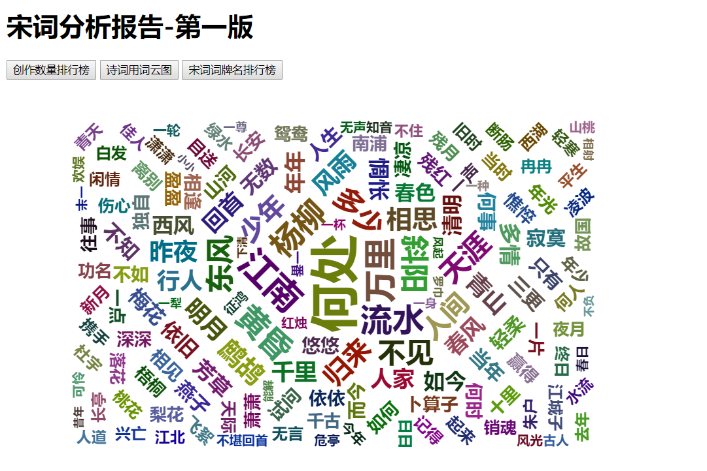

##项目名称
你所不知道的宋词奥秘

##项目描述
对于从儿时就开始学习的宋词三百首，我们从未以宏观的角度去解读过它们，因此该项目主要从宏观的角度研究唐诗三百首中每个作者创作诗的数量并且将这个结果通过一个柱状图来展示，
其次是研究宋词三百首中各个词语出现的频率，并且通过一个词云来形象的展示统计的结果。
##涉及技术
+ 后端：
+ 面向对象、多线程、集合框架、涉及模式、JDBC编程、数据库、常用类、Stream和Lambda
+ 第三方：
+ htmlunit、ansj、Sparkjava、Druid（数据库连接池）
+ 前端：
+ HTMl、JavaScript、jQuery、Echarts
+ 工具：
+ IDEA、Maven、Git/GitHub

##实现功能
+ 通过具体的数据可以得到宋词三百首里面谁的创作数量最高
+ 通过具体的数据可以得到宋词三百首里面每个词语出现频率的高低
##具体实现

+ 首先将网页抽象为一个类。
+ 爬虫的实现：采集原始数据然后解析原始数据最后清晰数据并存入数据库。
+ 通过从数据库中获取数据进行数据分析并统计作者创作数量、词语出现次数。
+ 将分析后的结果结合前端的知识将结果以图的形式展现在网页中。
##项目效果
+ 宋词三百首中作者创作排行榜柱状图

+ 宋词三百首中词语出现频率的词云展示

+ 宋词三百首中词牌名的使用频率排行榜

##扩展点
+ 了解反爬虫和反反爬虫思路
+ Web服务器选择Tomcat和Servlet

